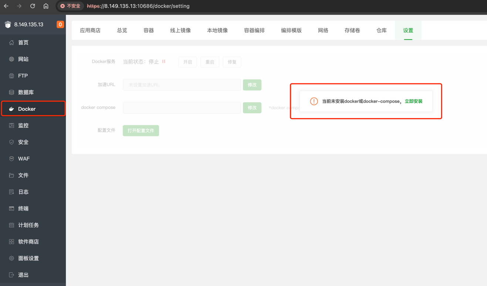
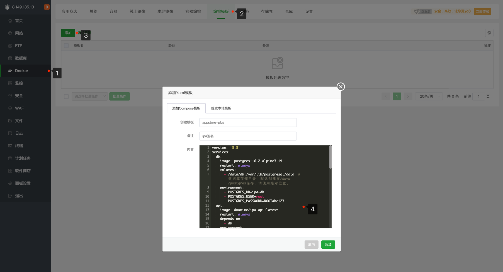
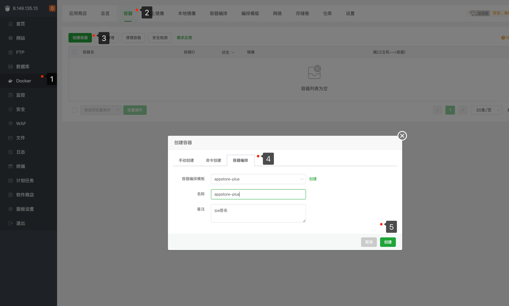
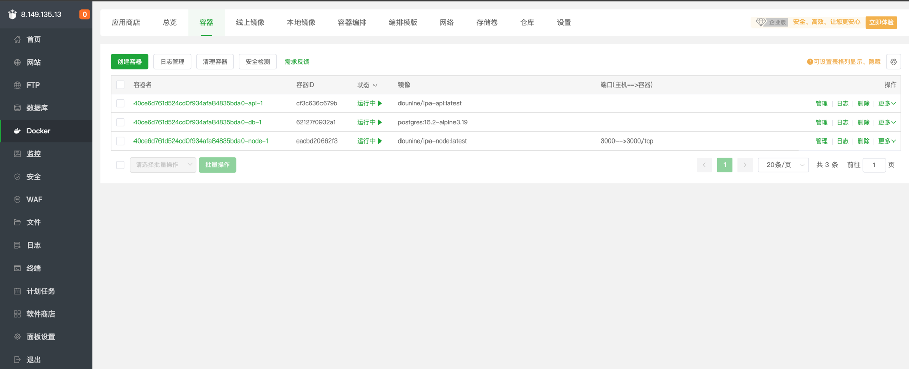
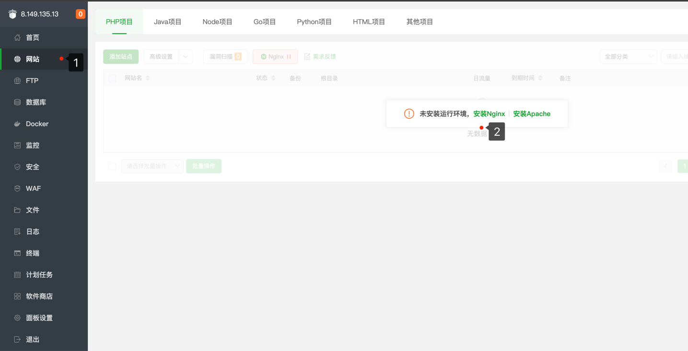
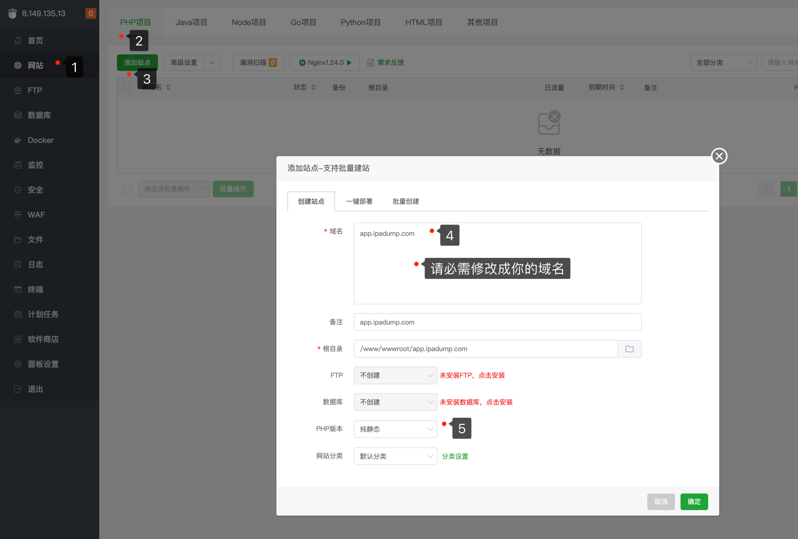
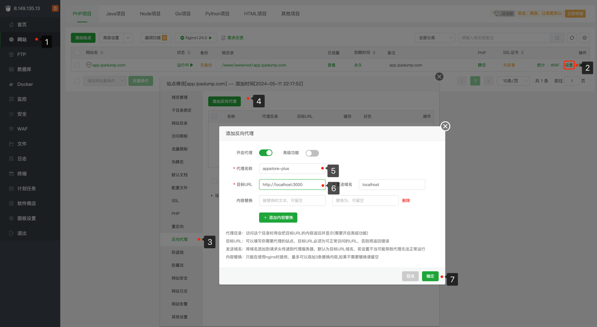
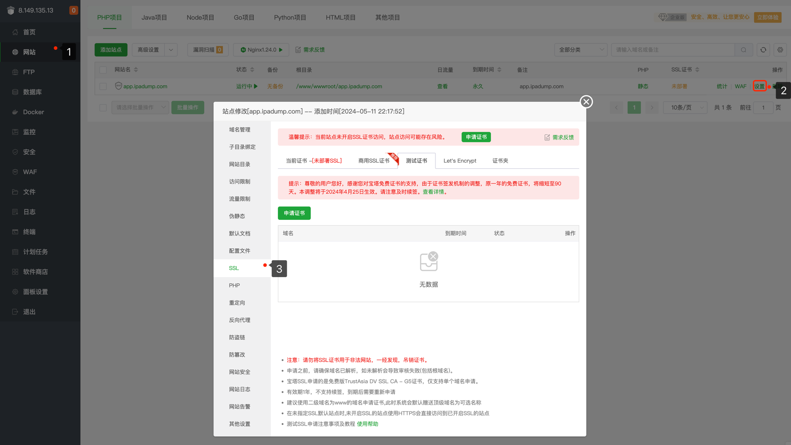
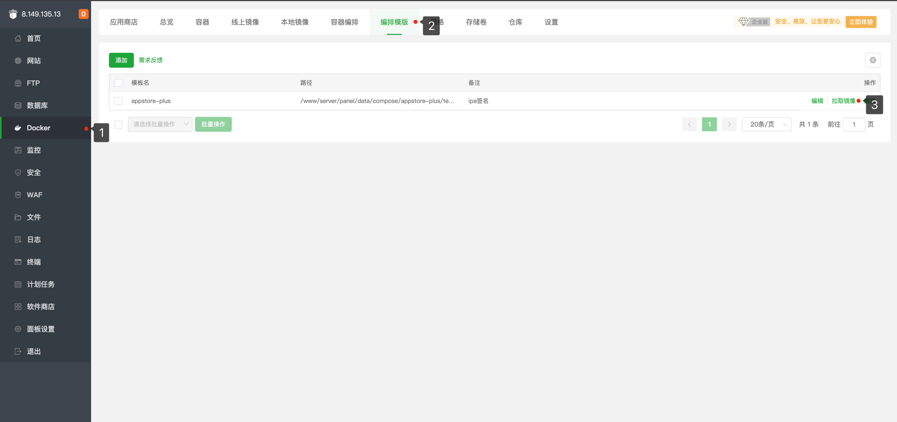
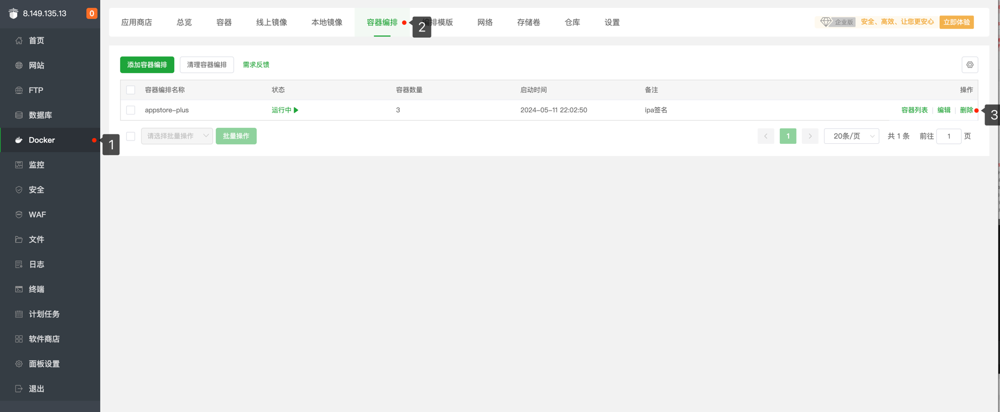

# appstore-plus
> appstore-plus 是一个基于网页在线安装ipa的工具，支持iOS 9.0以上版本，支持ipa文件的在线安装，可分享，可扫码安装，支持黑白主题。

[界面预览](./preview/README.md)

[](http://qm.qq.com/cgi-bin/qm/qr?_wv=1027&k=kPEQ7s8Tq_efdpfWI7JicqunBOdCtCKK&authKey=CjmL2v2EbiezEUXGBJFJHSb2mv0jt%2BE4K3Zt0R%2FWturqrVYSmENSiQHLg89xocnW&noverify=0&group_code=628633891)

# 宝塔面板搭建

### 1. [宝塔面板](https://www.bt.cn/new/download.html) 安装 
> 请自行安装宝塔后再操作

### 2. 安装docker模块
> 宝塔面板 -> Docker -> 立即安装 -> 选择默认安装即可



### 3. 修改下面配置并复制到宝塔编排模版
> domain：参数必须修改成自己的https域名，否则就算能签名也不能将ipa应用安装到ios手机上，例如修改成：https://app.ipadump.com
```yaml
version: '3.3'
services:
  db:
    image: postgres:16.2-alpine3.19
    restart: always
    volumes:
      - /data/db:/var/lib/postgresql/data  # 数据库存储目录，默认创建在/data/postgres保存，请使用绝对位置。
    environment:
      - POSTGRES_DB=ipa-db
      - POSTGRES_USER=root
      - POSTGRES_PASSWORD=ROOTAbc123
  api:
    image: dounine/ipa-api:latest
    restart: always
    depends_on:
      - db
    environment:
      - database_url=postgresql://root:ROOTAbc123@db:5432/ipa-db #帐号密码请与上面db服务一致，默认不会暴露到外部(安全)，如有需要请自行修改
      - domain=http://localhost:3000  # 对外访问地址，必需修改成自己的https域名，例如修改成：https://app.ipadump.com
      - release=true  # 是否为生产环境(不要修改)
      - log=error   # 日志级别(不要修改)
      - locale=zh-CN   # 默认语言(不要修改)
      - admin_username=admin   # 管理员账号(PS:请修改默认账号密码)
      - admin_password=admin   # 管理员密码(PS:请修改默认账号密码)
      - form_body_limit=10mb  # post body 限制(不要修改)
      - file_upload_block_size=5mb  # 文件上传分片大小(不建议修改)
      - ipa_file_limit=1gb    # ipa文件大小限制
      - clean_interval=1m    # 定时清理任务时间(不建议修改)
      - ipa_sign_file_expire=360m  # ipa签名过期时间,m分钟
      - ipa_file_save_time=60m   # ipa保存时间,无关联的ipa文件将被删除
      - ipa_file_temp_expire=60m  # ipa上传临时文件,超时将被删除
      - ipa_sign_storage_limit=10gb  # ipa签名存储总大小
      - ipa_sign_plugin_limit=10mb  # ipa签名插件限制大小
      - ipa_sign_plugin_count_limit=10  # ipa签名插件数量限制
      - ipa_icon_limit=5mb   # ipa图标大小限制
    volumes:
      - /data/app_file:/app/file  # ipa文件存储目录，默认创建在/data/app_file保存，请使用绝对位置。
      - /data/app_logs:/app/logs  # 日志存储目录，默认创建在/data/app_logs保存，请使用绝对位置。
  node:
    image: dounine/ipa-node:latest
    restart: always
    depends_on:
      - api
    ports:
      - "3000:3000"  # 请根据实际情况修改冒号左边的端口，如有占用，请使用其它未使用的端口
```



### 4. 创建编排模版
> 宝塔面板 -> Docker -> 容器 -> 创建容器 -> 容器编排 -> 选择刚才创建的模板即可



### 5. 创建成功如图
> 访问 [http://服务器ip:3000/zh-CN](http://服务器ip:3000/zh-CN) 即可访问签名站点，记得把3000端口加白名单



### 6. 域名反向代理
> 这里选择nginx作为反向代理，不反向代理ios设备无法安装ipa应用



### 7. 创建站点
> 第4点，请修改为你上面配置的domain，例如：https://app.ipadump.com



### 8. 站点反向代理配置
> 第6点，请修改为你上面暴露的端口，(不要修改成你对外的域名，重要的事说三遍!!!)，一般修改端口即可，默认：3000



### 9. ssl配置
> 请自行申请ssl证书，或者使用免费的测试证书，这里不做详细说明



### 祝你安装成功！！！

# 更新操作

### 1. 拉取最新镜像
> 宝塔面板 -> Docker -> 编排模版 -> 拉取最新镜像



### 2. 清理旧容器
> 宝塔面板 -> Docker -> 容器编排 -> 删除旧容器
> 旧容器删除(不影响数据!!!、不影响数据!!!、不影响数据!!!)，重新创建容器即可



### 3. 重新创建容器
> 宝塔面板 -> Docker -> 容器 -> 容器编排 -> 选择刚才创建的模板即可

请重新再根据上面【第4步】的步骤重新创建容器即可，反向代理不需要再操作

### 祝你更新成功！！！